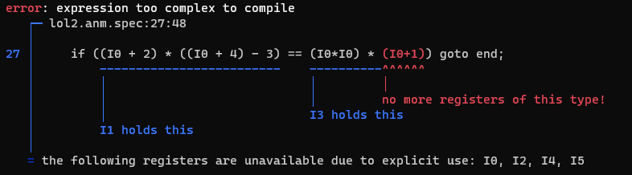

# truth

[](https://travis-ci.org/ExpHP/truth)

Multipass [THTK](https://github.com/thpatch/thtk/) alternative.



truth stands for "**t**htk **ru**st **th**ing".  Or maybe it stands for "**t**htk **ru**st **th**tk". I dunno, I mostly just picked it because `trustd` and `truecl` sound pretty dope.

## Development status

* `trustd`: in beta; **feature complete, please give it a try!**
* `truanm`: in alpha
* `trumsg`: extremely alpha, only partial game support

Supports **all danmaku titles TH06–TH17.**  That is:

> TH06 (EoSD), TH07 (PCB), TH08 (IN), TH09 (PoFV), TH09.5 (StB), TH10 (MoF), TH11 (SA), TH12 (UFO), TH12.3 (GFW), TH12.5 (DS), TH13 (TD), TH14 (DDC), TH14.3 (ISC), TH15 (LoLK), TH16 (HSiFS), TH16.5 (VD), TH17 (WBaWC)
> 
> Uwabami Breakers is also supported (use `-g alcostg` or `-g 103`)

## Docs

See these doc pages:

* A primer on [script syntax](./doc/syntax.md).
* A [comparison to thtk](./doc/comparison-to-thtk.md).

## Downloading

Get the latest Windows releases [right here on GitHub](https://github.com/ExpHP/truth/tags)!

Development builds may also be posted occationally on the `#tools-dev` channel on the [ZUNcode discord server](https://discord.gg/fvPJvHJ).

For even more bleeding edge, see [Building from source](#building-and-installing-from-source) below.

## Using

### STD files — `trustd`, and some general notes for all tools

Usage of `trustd` is pretty straightforward, so we'll take this opportunity to describe some features common to all of the tools.

Here's how you primarily use it:

```shell
trustd decompile -g13 -m map/any.stdm in.std > out.stdspec

trustd compile -g13 in.stdspec -o out.std
```

The subcommands can be abbreviated to any unambiguous prefix, e.g. `trustd decomp` or even `trustd d`.

Similar to thtk, the `-m` flag imports an ECLMAP-style file. Generally speaking this is only needed during decompilation, because when you are compiling a script, it can contain a reference to its own mapfile:

```C
#pragma mapfile "./map/any.anmm"
```

If you frequently decompile files for experimental purposes, you can also set the environment variable `TRUTH_MAP_PATH` to automatically locate mapfiles during decompilation.  Each directory listed in this `PATH`-like variable will be checked for a file named `any.stdm` if you are compiling STD, `any.anmm` if you are compiling ANM, and etc.

### ANM files — `truanm`

You can decompile an ANM file into a script, similar to `thanm -l`.

```sh
truanm decompile -g12 -m map/any.anmm in.anm > out.spec
```

#### Recompilation of a decompiled ANM file

To recompile an ANM file, you will likely need to supply the original ANM file as a source to copy image data from.  This can be done using the `-i`/`--image-source` flag:

```sh
truanm compile -g12 edited.spec -i original.anm -o out.anm
```

Alternatively, you can also put the following line in your script file, which is equivalent to `-i path/to/original.anm`:

```C
#pragma image_source "path/to/original.anm"
```

Note that there is no feature to extract images into PNG files, and it is doubtful that there ever will need to be, since `thanm -x` remains perfectly fine for this purpose.  There is also no way to embed new images from `.png` files, as thcrap's image hotloading is far superior anyways.

#### Compilation of brand new ANM files

 To compile a brand new ANM file that isn't based on any original ANM file, simply make sure to supply all necessary header data in the `entry` objects along with `has_data: false`; in this case, you do NOT require the `-i` flag.

An example of such a script be found in the [`anm_features` test file](./tests/integration/anm_features.rs), in the test `no_source::okay`.

To use the compiled file, make a thcrap patch which contains images in all of the right locations.  (for instance, if the script has a `has_data: false` entry with `path: "subdir/file.png"`, the thcrap patch should have an image at e.g. `<patch_root>/th17/subdir/file.png`)

## Building and installing from source

[Install rust](https://rustup.rs/), and then:

```sh
git clone https://github.com/ExpHP/truth
cd truth

# Debug builds  (for optimized builds, change it to `cargo run --release`)
cargo run -- trustd d -g10 -m map/any.stdm in.std > out.stdspec
cargo run -- trustd c -g10 out.stdspec -o out.std

# If you want optimized binaries installed globally:
cargo install --path=.
```

**Important:** Notice that development builds use `cargo run -- trustd` instead of `cargo run --bin=trustd`.  This is because most binaries in this project are actually shims around the main binary (`truth-core`), and if you do `--bin=trustd` then that main binary won't be rebuilt.
